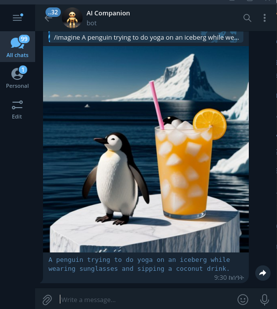

# AI Companion Bot

A Telegram bot interface for AI models available for free via Cloudflare [Workers AI](https://developers.cloudflare.com/workers-ai/) API.



## Setup

### Cloudflare Workers AI
Before running the app, you need to register for free Cloudflare account and obtain your Account ID and Worker AI API token.

After obtaining your cloudflare Account ID and API token, assign them to environment variables `CLOUDFLARE_ACCOUNT_ID` and `CLOUDFLARE_API_TOKEN`

### Telegram Bot
Create Telegram bot by sending `/newbot` to [@Botfather](https://t.me/botfather) and following instructions, Once the bot is created, Botfather will provide you with a token. Copy the token and assign it to environment variable `TELEGRAM_BOT_TOKEN`

Finally, Set SITE_URL env variable to the url where the app is hosted. if you are running the app locally, you can use ngrok

## Running the App
* Build & Run the Docker image
```sh
docker build -t ai_companion .
```
```sh
docker run --env-file .env -p 8000:8000 ai_companion:latest
```

## Usage
Once the docker container is running, You can interact with your bot using text or voice messages.

* `/start` - Start the conversation
* `/imagine <prompt>` - Generate images based on the provided prompt.
* Text messages - Send text messages to engage in a text conversation with the bot.
* Voice messages - Send voice messages to engage in voice conversation with the bot. 
